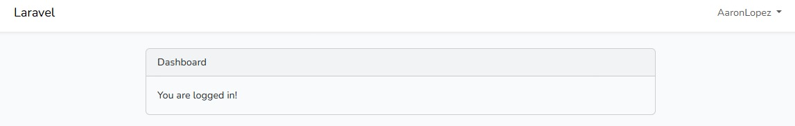
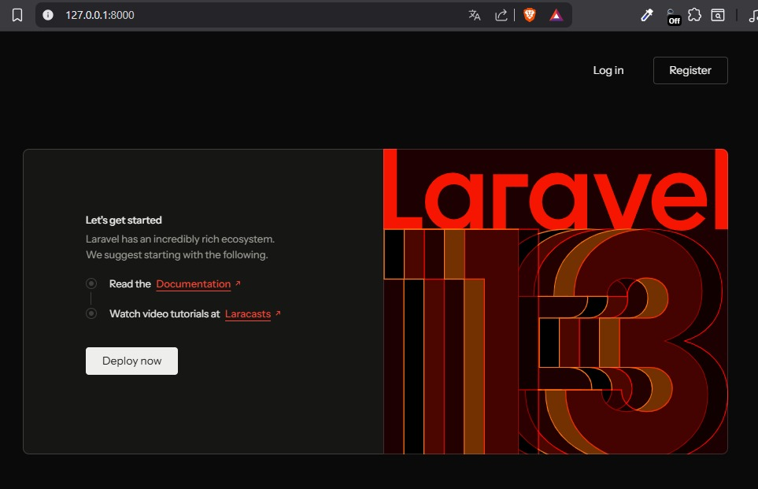

# 🚀 Laboratorio #2 – Implementación del Login en Laravel

<div align="center">


**Universidad Tecnológica de Panamá**  
Facultad de Ingeniería de Sistemas Computacionales – Campus Victor Levis Sasso  
**Desarrollo de Software VII**

</div>

---

## 📋 Tabla de Contenidos

- [Objetivo del Laboratorio](#-objetivo-del-laboratorio)
- [Requisitos Previos](#-requisitos-previos)
- [Arquitectura MVC en Laravel](#-arquitectura-mvc-en-laravel)
- [Flujo de Comandos Utilizados](#-flujo-de-comandos-utilizados)
- [Base de Datos](#-base-de-datos)
- [Resultado del Laboratorio](#-resultado-del-laboratorio)
- [Dificultades y Soluciones](#-dificultades-y-soluciones)
- [Referencias](#-referencias)
- [Footer](#-información-del-estudiante)

---

## 🎯 Objetivo del Laboratorio

Implementar un sistema de autenticación (Login) en Laravel utilizando las herramientas propias del framework, comprendiendo la arquitectura **Modelo-Vista-Controlador (MVC)** y configurando correctamente el entorno de desarrollo local con base de datos MySQL.

---

## 🛠️ Requisitos Previos

### Ecosistema de Desarrollo

| Tecnología | Versión | Descripción |
|---|---|---|
|  | 8.4.15 | Lenguaje de programación del servidor |
|  | Latest | Gestor de dependencias PHP |
|  | 13.5.0 | Framework PHP principal |
|  | 3.x | Entorno de desarrollo local (Apache + MySQL + PHP) |
|  | 2.4 | Servidor web |
|  | 8.0 | Base de datos relacional |
|  | Latest | Editor de código recomendado |
|  | Latest | Gestor de paquetes para frontend (Vite + Tailwind) |
|  | 10/11 | Sistema Operativo |

### Instalación de Dependencias

```bash
# 1. Crear el proyecto Laravel
laravel new ProyecLaravel

# 2. Ingresar al proyecto
cd ProyecLaravel

# 3. Instalar dependencias PHP
composer install

# 4. Copiar el archivo de entorno
cp .env.example .env

# 5. Generar clave de aplicación
php artisan key:generate
```

### Configuración del archivo `.env`

```env
DB_CONNECTION=mysql
DB_HOST=127.0.0.1
DB_PORT=3306
DB_DATABASE=laravel
DB_USERNAME=root
DB_PASSWORD=
```

---

## 🏗️ Arquitectura MVC en Laravel

Laravel sigue el patrón **Modelo-Vista-Controlador (MVC)**, que separa la lógica de negocio, la presentación y el control del flujo de la aplicación.

```
ProyecLaravel/
│
├── 📁 app/
│   ├── 📁 Http/
│   │   └── 📁 Controllers/     ← CONTROLADORES: lógica de la aplicación
│   ├── 📁 Models/              ← MODELOS: representan las tablas de BD
│   └── 📁 Providers/           ← Proveedores de servicios (AppServiceProvider)
│
├── 📁 resources/
│   └── 📁 views/               ← VISTAS: interfaz HTML con Blade
│
├── 📁 routes/
│   └── web.php                 ← RUTAS: mapeo URL → Controlador
│
├── 📁 database/
│   └── 📁 migrations/          ← Definición de tablas de la base de datos
│
└── .env                        ← Configuración del entorno
```

### Rol de cada componente:

- **Modelos** (`app/Models/`) – Interactúan con la base de datos. El modelo `User.php` gestiona la tabla de usuarios.
- **Vistas** (`resources/views/`) – Archivos Blade (`.blade.php`) que renderizan el HTML visible al usuario.
- **Controladores** (`app/Http/Controllers/`) – Reciben las peticiones HTTP, procesan la lógica y retornan una respuesta o vista.
- **Rutas** (`routes/web.php`) – Definen qué controlador o acción se ejecuta según la URL solicitada.

---

## ⚙️ Flujo de Comandos Utilizados

### Creación y configuración del proyecto

```bash
# Crear proyecto con Laravel Installer
laravel new ProyecLaravel

# Al crear, se aceptó instalar dependencias npm y compilar assets
# Would you like to run npm install and npm run build? → yes
```

### Compilación de assets con Vite

```bash
# Compilación para producción (se ejecutó automáticamente al crear el proyecto)
npm run build

# Para desarrollo con hot-reload
npm run dev
```

### Levantar el servidor de desarrollo

```bash
# Opción 1: Todo en uno (servidor + Vite)
composer run dev

# Opción 2: Por separado
php artisan serve       # Terminal 1 - servidor Laravel
npm run dev             # Terminal 2 - compilador Vite
```

### Migraciones

```bash
# Ejecutar todas las migraciones (crear tablas)
php artisan migrate

# Reiniciar todas las tablas desde cero
php artisan migrate:fresh
```

---

## 🗄️ Base de Datos

### Entorno de Base de Datos

- **Motor:** MySQL 8.0 vía WampServer
- **Herramienta de administración:** phpMyAdmin (`http://localhost/phpmyadmin`)
- **Base de datos utilizada:** `laravel`
- **Usuario:** `root` (sin contraseña — entorno local)

### Tablas generadas por las migraciones

| Tabla | Descripción |
|---|---|
| `users` | Almacena los usuarios registrados |
| `sessions` | Gestiona las sesiones activas |
| `cache` | Almacenamiento en caché |
| `cache_locks` | Control de bloqueos de caché |
| `jobs` | Cola de trabajos en background |
| `job_batches` | Lotes de trabajos |
| `failed_jobs` | Registro de trabajos fallidos |
| `password_reset_tokens` | Tokens para restablecimiento de contraseña |

### Comandos para gestión de la base de datos

```bash
# Crear las tablas
php artisan migrate

# Ver estado de las migraciones
php artisan migrate:status

# Generar respaldo desde phpMyAdmin:
# phpMyAdmin → Seleccionar BD 'laravel' → Exportar → SQL → Ejecutar
```

> 📎 El archivo de respaldo `laravel_backup.sql` se encuentra en la raíz del repositorio.

---

## 📸 Resultado del Laboratorio

Al finalizar el laboratorio, el proyecto Laravel quedó funcionando correctamente en:

```
http://127.0.0.1:8000
```
### Dashboard tras iniciar sesión


### Pantalla de Inicio – Laravel 13


La pantalla de inicio de Laravel 13 fue visible con todos los assets de Tailwind CSS compilados correctamente mediante Vite.

> ✅ Servidor activo | ✅ Base de datos conectada | ✅ Migraciones ejecutadas | ✅ Assets compilados

---

## ⚠️ Dificultades y Soluciones

### 1. Base de datos no existía al ejecutar migraciones

**Error:**
```
SQLSTATE[HY000] [1049] Unknown database 'laravel'
```
**Causa:** El archivo `.env` tenía las líneas de base de datos comentadas con `#`, y la base de datos no había sido creada previamente.

**Solución:**
- Se creó la base de datos `laravel` manualmente desde phpMyAdmin.
- Se descomentaron las líneas `DB_HOST`, `DB_PORT`, `DB_DATABASE`, `DB_USERNAME` y `DB_PASSWORD` en el archivo `.env`.

---

### 2. Error de longitud de clave en MySQL

**Error:**
```
SQLSTATE[42000]: Syntax error or access violation: 1071
Specified key was too long; max key length is 1000 bytes
```
**Causa:** La versión de MySQL en WampServer no soporta el tamaño de índice por defecto de Laravel moderno.

**Solución:**  
Se modificó el archivo `app/Providers/AppServiceProvider.php` agregando:

```php
use Illuminate\Support\Facades\Schema;

public function boot(): void
{
    Schema::defaultStringLength(191);
}
```

Luego se ejecutó `php artisan migrate:fresh` para recrear las tablas correctamente.

---

### 3. Comando `composer run dev` desconocido

**Causa:** El video tutorial seguido utilizaba una versión anterior de Laravel donde este comando no existía. En Laravel 13 este comando es nuevo y ejecuta el servidor junto con Vite simultáneamente.

**Solución:** Se ejecutó `composer run dev` directamente desde el CMD, lo que levantó correctamente el servidor en `http://127.0.0.1:8000`.

---

## 📚 Referencias

1. **Laravel Documentation – Getting Started**  
   https://laravel.com/docs/13.x

2. **Laravel Documentation – Database Migrations**  
   https://laravel.com/docs/13.x/migrations

3. **WampServer Official Site**  
   https://www.wampserver.com/

4. **phpMyAdmin Documentation**  
   https://www.phpmyadmin.net/docs/

5. **Vite + Laravel Integration**  
   https://laravel.com/docs/13.x/vite

---

## 👨‍💻 Información del Estudiante

<div align="center">

---

*Este laboratorio ha sido desarrollado por el estudiante de la **Universidad Tecnológica de Panamá**:*

| Campo | Detalle |
|---|---|
| **Nombre** | Aaron Lopez |
| **Correo** | aaron.lopez2@utp.ac.pa |
| **Curso** | Desarrollo de Software VII |
| **Instructor del Laboratorio** | Ing. Irina Fong |
| **Fecha de Ejecución** | 16 de abril de 2026 |
| **Fecha Límite de Entrega** | 22 de abril de 2026 |

---

*Facultad de Ingeniería de Sistemas Computacionales – Campus Victor Levis Sasso*  
*Universidad Tecnológica de Panamá*

</div>
